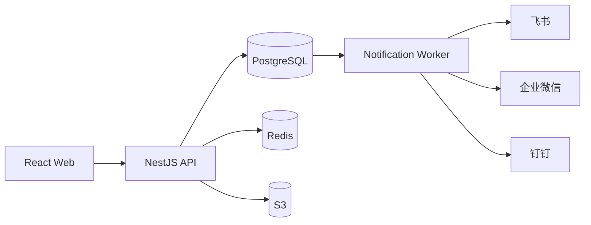

# Veritab 生产架构

## 系统定位

Veritab 是 TypeScript Monorepo 形式的模块化单体应用，面向 100–200 人同时在线的研发团队。当前业务数据唯一事实源是 PostgreSQL；浏览器存储仅用于无业务含义的界面偏好。

## 运行组件

- `apps/web`：React 19、Vite、TanStack Query 和 Tailwind CSS。业务模块通过受认证 API 访问数据。
- `apps/api`：NestJS 11、Fastify 5 和 Prisma 6。负责认证、项目空间 RBAC、业务事务、审计及 OpenAPI。
- PostgreSQL 16：用户、组织、项目空间、需求、缺陷、用例、代码变更、附件元数据、审计和 Outbox。
- Redis 7：面向缓存和短生命周期协调，不作为业务事实源。
- S3 兼容存储：通过预签名 URL 直传和下载；附件元数据及资源归属保存在 PostgreSQL。
- Notification Worker：展开领域事件并逐渠道投递飞书、企业微信和钉钉 Webhook。
- Maintenance Worker：清理超期未完成上传等维护任务。

## 关键数据流

需求、缺陷和用例的写操作在同一数据库事务内完成以下内容：

1. 更新领域实体并执行乐观并发版本检查。
2. 写入实体历史和组织审计日志。
3. 写入领域 Outbox 事件。

Notification Worker 使用 `FOR UPDATE SKIP LOCKED` 抢占领域事件，根据项目空间内已启用渠道的事件订阅，原子生成逐渠道 `NotificationRequested` 事件。每个渠道独立重试，失败不会回滚业务事务或阻塞其他渠道。

## 安全边界

- 密码使用 Argon2 哈希；Access Token 只保存在页面内存，Refresh Token 使用 HttpOnly Cookie。
- 所有业务 API 同时校验组织、项目空间成员关系和细粒度权限，前端权限只用于界面呈现。
- Webhook 地址和签名密钥使用 AES-256-GCM 加密，读取 API 永不返回明文或密文。
- AI Provider 密钥只允许从服务端环境或 Secret Manager 注入。
- 所有更新 DTO 经过白名单验证；关键资源使用 `version` 防止并发静默覆盖。
- API 使用安全响应头、请求大小限制、速率限制和结构化请求日志；日志不得包含密码、令牌、Webhook URL 或外部响应正文。

## 扩展策略

当前规模保持模块化单体，避免无实际收益的微服务复杂度。API 和 Worker 均为无状态进程，可横向扩容；PostgreSQL Outbox 通过跳过锁定行支持多个 Worker 并行消费。只有在容量、团队所有权或故障隔离出现明确需求时，才按现有模块和领域事件边界拆分服务。

生产部署、Secret 要求、健康检查和资源限制参见 [deployment.md](deployment.md)。
