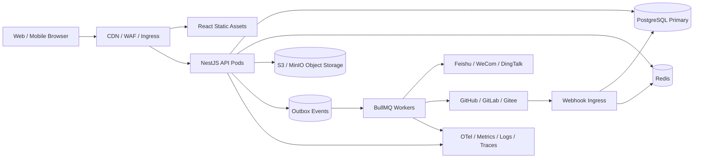

# Veritab Agile Platform — 架构设计

> 文档状态：已确认并进入实施
> 历史基线：原始前端 Demo；有效 Web 代码现位于 `apps/web/`
> 目标规模：100–200 人同时在线；设计上可平滑扩展到 1,000+ 在线用户
> 本阶段边界：只完成现状分析与目标架构，不开始后端实现

## 1. 执行摘要与架构决策

Veritab 当前不是“已有后端的全栈项目”，而是一个业务功能覆盖较完整的单体 React Demo：项目、用户、需求、缺陷、测试用例、文件夹和系统配置主要保存在浏览器 `localStorage`；Express 仅承担 AI 与飞书 Webhook 的代理/模拟功能，不具备数据库、认证、服务端授权、审计和可靠异步任务能力。

推荐把项目升级为 **TypeScript 全栈 Monorepo + 模块化单体后端（Modular Monolith）**：

- Web：React + Vite + TypeScript + TanStack Router/Query + Zustand。
- API：NestJS + Fastify Adapter + Prisma + PostgreSQL。
- 基础设施：Redis + BullMQ、S3 兼容对象存储、OpenTelemetry。
- 交付：Docker；开发/演示使用 Docker Compose，生产优先 Kubernetes 或云托管容器服务。
- 集成：飞书/企业微信/钉钉、GitHub/GitLab/Gitee 均通过“入站事件落库 + 队列异步处理 + 幂等重试”接入。
- 架构形态：当前规模不采用微服务。先建立清晰模块边界、领域事件和 Outbox；只有在容量、团队所有权或故障隔离出现真实需求时再拆服务。

选择 NestJS 而非 FastAPI 的主要原因是当前团队资产和前端均为 TypeScript，可共享契约、校验规则和工程工具；NestJS 的模块、Guard、Interceptor、DI、Swagger、BullMQ 和 WebSocket 生态适合权限密集、集成较多的协作平台。AI/数据分析若以后需要 Python，可单独增加 Python Worker，而不必让主业务 API 改用 Python。

## 2. 当前源码审计

### 2.1 实际技术基线

以当前 `package.json` 和源码为准，而不是上传说明中的预期版本：

| 项目 | 当前实际情况 | 结论 |
| --- | --- | --- |
| React | `react` / `react-dom` 19.0.1 | 不是描述中的 React 18；后续应锁定确切版本并验证第三方兼容性 |
| 构建 | Vite 6.2.3、TypeScript 5.8 | 开发体验好，适合保留 |
| 样式 | Tailwind CSS 4 + `@tailwindcss/vite` | 可保留，但需要设计 Token 和组件规范 |
| 动效/图标 | motion、lucide-react | 可保留；需控制动效和图标包体积 |
| 图表/脑图 | 当前依赖中没有 d3/recharts | 源码脑图主要依赖 React/DOM 布局；不能按“已安装 d3/recharts”设计 |
| 服务端 | 单文件 Express `server.ts` | 仅 Demo 代理，不是生产后端 |
| 数据 | `data.ts` mock + `localStorage` | 无共享、事务、一致性、备份能力 |
| 网络请求 | 仅 AI、通知、建群 3 类 fetch | 核心业务没有 API 层 |
| 测试/质量 | 无单元、集成、E2E 测试脚本；`lint` 实为 `tsc --noEmit` | 不满足商用门禁 |
| 包管理锁 | 当前目录无锁文件 | 构建不可复现，需统一 pnpm 并提交 lockfile |

### 2.2 技术栈优点

- React + TypeScript 适合复杂的看板、抽屉、表单和脑图交互，人才与生态成熟。
- Vite 启动和增量构建速度快，适合中后台持续迭代。
- Tailwind 便于快速形成一致布局；motion 能改善复杂状态切换体验。
- 现有 Demo 已覆盖项目空间、需求、缺陷、测试、代码变更、报表、通知、用户组、SSO 配置等主要业务语义，可作为需求原型和验收参照。
- `types.ts` 已有较丰富的前端领域类型，适合迁移为 API 契约的输入，但不能直接当数据库模型。
- 部分列表已使用 `useMemo`、分页和独立组件，说明可在不推翻 UI 的前提下渐进重构。

### 2.3 核心问题与风险

#### 状态管理与组件边界

- `App.tsx` 超过 1,000 行，集中持有 projects、users、groups、issues、testCases、folders、systemConfig 和大量 UI 状态，并把更新函数层层传递，形成 prop drilling 和全量重渲染风险。
- `TestCaseXMindMindmap.tsx` 约 2,500 行；`DefectsBoard.tsx`、`RequirementsBoard.tsx`、`TestCaseWorkspace.tsx` 均超过 1,200 行。业务规则、展示、网络、弹窗和通知耦合，难以测试和多人并行开发。
- 需求与缺陷共用 `Issue` 联合模型，前端枚举和可选字段过多；长期会造成非法状态可以被类型表达。
- 页面导航由本地 `activeTab` 控制，没有 URL 路由。刷新、深链接、浏览器回退、权限拦截和分享链接不可靠。
- 存在大量直接 DOM 查询、全局键盘监听和组件级临时状态；脑图规模增大后容易产生布局抖动、监听冲突和渲染瓶颈。

#### API、持久化与一致性

- 核心业务没有 Repository/API Client；状态更新后直接写 `localStorage`，无法支持多人协作、并发编辑、事务、审计、备份或服务端检索。
- 客户端生成业务 ID，多个用户并发时无法保证唯一性和有序性。
- 列表筛选、排序和分页主要在浏览器内完成；数据量增长后会下载过量数据并阻塞主线程。
- 没有服务端版本号或 ETag，需求、缺陷、测试用例多人编辑会发生静默覆盖。
- 没有离线/重试/幂等语义；通知调用失败只返回即时结果，刷新后丢失。

#### 安全与商用合规

- 登录是客户端模拟，默认管理员自动存在；退出也只是本地标记。没有可信身份边界。
- 权限由前端 `checkPermission` 决定，绕过 UI 即可越权；项目空间隔离没有服务端强制执行。
- Demo 中密码可明文保存在用户对象/`localStorage`；Webhook 密钥、模型 API Key、SSO 配置也可能到达浏览器。生产环境必须彻底禁止。
- Express 路由无认证、无鉴权、无 DTO 校验、无速率限制、无审计；客户端还可提交任意模型 endpoint 和 Webhook URL，存在 SSRF、内网探测、凭据泄漏和资源滥用风险。
- Webhook 日志可能打印目标 URL；若 URL 携带密钥会进入日志。
- 文件导入/Markdown/附件目前没有统一的文件类型、大小、病毒扫描、内容安全和下载授权机制。
- 缺少 CSP、CSRF 策略、安全响应头、密钥轮换、数据保留与删除策略。

#### 性能、可维护性与交付

- 顶层状态改变可能使大面积组件树重渲染；脑图一次渲染大量卡片时缺少虚拟化或画布分层。
- 业务页面没有路由级懒加载；图标、动效和大组件会增加首屏包体。
- 无统一错误边界、请求取消、缓存失效、骨架屏和服务端分页约定。
- 无 ESLint、Prettier、测试覆盖、契约测试、数据库迁移、CI/CD、镜像、健康检查和可观测性。
- 单一 `server.ts` 同时承载开发 Vite、中转外部请求和静态文件，职责混合，无法独立扩缩容。

### 2.4 前端目标方案

1. **服务端状态**：TanStack Query 管理请求缓存、去重、分页、乐观更新、失效和错误重试；不把 API 数据复制到 Zustand。
2. **客户端状态**：Zustand 只保存导航偏好、抽屉、脑图视口、未提交草稿等跨组件 UI 状态；短生命周期状态仍留在组件内。
3. **路由**：TanStack Router（或 React Router）建立 `/spaces/:spaceId/requirements/:id` 等可分享、可鉴权、可恢复的 URL。
4. **表单与验证**：React Hook Form + Zod；API 生成类型作为边界，禁止 `any` 穿透业务层。
5. **API 契约**：Nest Swagger/OpenAPI 生成 TypeScript Client；统一 Problem Details 错误、分页游标、过滤语法和 `Idempotency-Key`。
6. **模块化**：按 feature 拆分 `requirements/`、`defects/`、`test-cases/` 等；容器组件取数，展示组件保持纯净。
7. **并发编辑**：实体增加 `version`，更新携带期望版本；冲突返回 409 并提示比较/重载。重要表单可增加草稿自动保存。
8. **性能**：路由懒加载、列表虚拟化、稳定 selector、Web Worker 处理大型导入/脑图布局、附件直传对象存储。
9. **脑图**：把节点规范化为 `TestCaseNode`；保存操作采用批量 Patch/命令，支持版本快照和操作日志。100–200 在线阶段用 WebSocket 推送变更/存在状态；真正的同时编辑需要后续引入 Yjs/CRDT，不能仅靠 WebSocket 广播。
10. **质量**：Vitest + Testing Library 做单元/组件测试，MSW 做 API Mock，Playwright 覆盖登录、需求流转、缺陷闭环、脑图保存、权限越权等关键路径。

## 3. 目标系统架构



### 3.1 架构原则

- PostgreSQL 是业务事实源；Redis 不是事实源，缓存丢失不得影响正确性。
- 所有授权在服务端执行；前端权限只用于体验优化。
- 所有项目域表必须带 `organization_id`、`project_space_id`（适用时）并建立组合索引。
- 外部副作用不与数据库事务直接耦合；使用 Transactional Outbox 保证“业务提交后最终发送”。
- API/Worker 无状态，可水平扩展；文件不落容器本地盘。
- 默认拒绝、最小权限、全链路审计、密钥只在服务端保存。
- 优先模块化单体，保留可拆分边界，不预付微服务复杂度。

## 4. 后端推荐技术栈

| 分层 | 推荐 | 理由 |
| --- | --- | --- |
| Runtime | Node.js 当前 LTS + TypeScript strict | 与前端同语言、共享工具链，适合 I/O 密集 API 与集成服务 |
| Framework | NestJS + Fastify Adapter | 模块/DI/Guard/Interceptor 成熟；Fastify 有更低开销；OpenAPI 生态完善 |
| ORM | Prisma | 类型安全、迁移清晰、事务 API 适合主业务；复杂报表可用参数化 SQL/只读视图补充 |
| Database | PostgreSQL 16+ | 强事务、JSONB、全文搜索、丰富索引、RLS/逻辑复制，适合关系和追溯数据 |
| Cache/Queue | Redis 7 + BullMQ | 缓存、分布式限流、会话/撤销标记、异步重试和定时任务 |
| Validation | class-validator/class-transformer 或 Zod（项目统一其一） | DTO 边界拒绝未知字段并统一错误输出 |
| API Docs | `@nestjs/swagger` + OpenAPI Client Generator | 文档与前端类型可自动同步 |
| Auth | Passport + JWT/JWK + Argon2id | 本地账户、OIDC/SAML 扩展成熟 |
| Realtime | Nest WebSocket Gateway（Socket.IO） | 在线状态、评论、状态变更和任务进度通知 |
| Observability | Pino + OpenTelemetry + Prometheus | 结构化日志、指标、跨 API/Worker/DB 追踪 |
| Testing | Jest/Vitest + Supertest + Testcontainers | 单元、集成、真实 PostgreSQL/Redis 测试 |

### 4.1 为什么主 API 不选 FastAPI

FastAPI 在 Python AI/数据处理服务上很优秀，但当前主系统的复杂度主要来自权限、工作流、事务、通知和 Git 集成，而不是数值计算。使用 NestJS 可减少前后端语言切换、复用 TypeScript 能力，并以 Guard/Decorator 统一权限。若未来有 LLM、向量检索、测试生成或数据分析任务，建议新增隔离的 FastAPI/Python Worker，通过队列或内部 API 调用；这比让主业务 API 一开始就承担双语言维护成本更稳妥。

## 5. 后端模块边界

- `identity`：用户、凭据、登录、Token、MFA、SSO、SCIM 预留。
- `organizations`：组织、成员、邀请、组织设置。
- `project-spaces`：项目空间、成员、角色绑定、空间设置。
- `iterations`：迭代、容量、时间范围、状态。
- `requirements`：需求、看板状态、验收标准、附件、历史。
- `defects`：缺陷、严重级别、工作流、评论、修复版本。
- `test-cases`：目录、用例、脑图节点、步骤、执行、执行结果、版本快照。
- `traceability`：需求—用例—执行—缺陷—提交/PR 的关联图。
- `code-changes`：仓库、Commit、PR/MR、分支、文件变更、关联规则。
- `files`：预签名上传、元数据、扫描、访问控制、生命周期。
- `notifications`：站内信、模板、订阅、渠道投递记录。
- `integrations`：飞书/企微/钉钉/Git Provider 配置、入站 Webhook。
- `workflows`：状态机、转换 Guard、可配置规则（首版保持受控配置）。
- `audit`：不可变审计事件、导出。
- `reporting`：聚合指标、异步报表、物化视图。
- `ai`：服务端模型路由、提示模板、脱敏、配额与审计；绝不接收任意客户端 endpoint。

模块间通过应用服务和领域事件交互，不允许跨模块任意访问 Prisma Model。第一版仍部署为一个 API 和一个 Worker，代码边界为后续拆分提供基础。

## 6. 数据库设计

### 6.1 核心实体

| 领域 | 核心表 |
| --- | --- |
| 身份 | `users`, `credentials`, `refresh_sessions`, `identity_providers`, `external_identities` |
| 租户 | `organizations`, `organization_members`, `project_spaces`, `project_members` |
| 权限 | `roles`, `permissions`, `role_permissions`, `role_bindings`, `user_groups`, `group_members` |
| 研发 | `iterations`, `requirements`, `defects`, `comments`, `attachments`, `tags`, `entity_tags` |
| 测试 | `test_case_folders`, `test_cases`, `test_case_nodes`, `test_steps`, `test_runs`, `test_results`, `test_case_versions` |
| 追溯 | `entity_links`（带约束的多态关联）或按高频关系拆表 |
| 代码 | `git_connections`, `repositories`, `commits`, `pull_requests`, `file_changes`, `code_entity_links` |
| 通知 | `notification_preferences`, `notifications`, `delivery_attempts`, `webhook_endpoints`, `webhook_events` |
| 平台 | `audit_logs`, `outbox_events`, `idempotency_keys`, `jobs`, `feature_flags` |

### 6.2 数据建模约束

- 主键使用 UUIDv7；对外展示号单独存储，如 `REQ-202607-000123`，由数据库序列/号段服务生成。
- 所有租户数据显式包含 `organization_id`；项目数据同时包含 `project_space_id`。
- 通用字段：`created_at`、`updated_at`、`created_by`、`updated_by`、`version`；需要软删的实体增加 `deleted_at`。
- 金丝雀式启用 PostgreSQL RLS：应用层过滤是第一层，RLS 是纵深防御。连接事务开始时设置可信租户上下文；不得把客户端 header 直接作为 RLS 上下文。
- 状态字段采用数据库 Enum 或受约束字符串；所有状态转换由领域服务校验，不允许任意 PATCH。
- 评论、审计、投递记录采用追加写；业务实体更新同时写历史/Outbox。
- 时区统一存 UTC `timestamptz`，界面按用户时区显示。
- 密钥只保存 KMS 包封加密后的密文与 key version；密码仅存 Argon2id hash。

### 6.3 索引与搜索

- 高频列表：`(project_space_id, status, updated_at DESC, id)`，支持游标分页。
- 分配给我：`(project_space_id, assignee_id, status, updated_at DESC)`。
- 外部事件幂等：`UNIQUE(provider, delivery_id)`。
- Git 对象：`UNIQUE(repository_id, commit_sha)`、`UNIQUE(repository_id, provider_pr_id)`。
- 业务展示号：`UNIQUE(project_space_id, display_no)`。
- 模糊搜索首版使用 PostgreSQL `tsvector` + `pg_trgm`；数据和查询量明显增长后再引入 OpenSearch，避免双写过早复杂化。
- 审计日志和投递记录按月分区并设置保留策略。

### 6.4 一致性与事务

- 创建/更新业务实体、审计记录和 Outbox Event 在一个 PostgreSQL 事务中完成。
- Worker 用 `event_id`/业务幂等键去重；外部投递采用指数退避 + jitter，达到阈值进入 DLQ。
- 关键更新使用乐观锁 `WHERE id = ? AND version = ?`；失败返回 `409 CONFLICT`。
- 导入操作先上传文件并创建 ImportJob，异步校验后分批事务写入，生成可下载错误报告。

## 7. 认证、SSO 与会话安全

### 7.1 Token 方案

- Access Token：短期 JWT，建议 10–15 分钟；仅包含 `sub`、`org_id`、session id、基础 claim，不塞入完整权限列表。
- Refresh Token：高熵随机 opaque token，放 `HttpOnly + Secure + SameSite=Lax/Strict` Cookie；数据库只存 hash。
- Refresh Token Rotation：每次刷新废弃旧 token 并创建新 token；检测复用时撤销整个 token family。
- 浏览器不把 access/refresh token 放 `localStorage`。推荐 BFF 风格 Cookie 会话，或 access token 仅内存保存并通过 refresh cookie 续期。
- JWT 使用非对称签名（EdDSA/RS256）和 `kid`，支持密钥轮换；验证 issuer、audience、exp、nbf。
- 登录、刷新、重置密码、SSO callback 分别限流；登录失败使用账户/IP 组合策略，避免可枚举响应。
- 本地密码 Argon2id；提供 MFA/TOTP 和恢复码的演进路径。

### 7.2 SSO

- 首选 OIDC Authorization Code + PKCE，支持企业 IdP（Azure AD/Entra ID、Keycloak、Authing 等）。
- 企业客户需要时增加 SAML 2.0 Adapter；Provider 按 Organization 配置。
- `external_identities(provider_id, subject)` 唯一绑定本地用户；默认不按邮箱静默合并，避免账号接管。
- JIT Provisioning 可配置默认组织角色；项目空间角色仍需显式授权。
- 预留 SCIM 2.0 做企业用户/组自动同步和离职回收。
- SSO client secret、证书私钥由 KMS/Secret Manager 管理，不下发前端。

## 8. 细粒度 RBAC（项目空间权限）

### 8.1 模型

采用“RBAC + Scope + 条件”的模型：

- Permission：稳定动作码，例如 `requirement.read`、`requirement.update`、`defect.transition`、`testcase.execute`、`integration.manage`。
- Role：权限集合；系统内置 `org_admin`、`space_admin`、`product_owner`、`developer`、`tester`、`viewer`，允许组织复制为自定义角色。
- RoleBinding：`subject(user|group)` + `role` + `scope(organization|project_space)`。
- Condition：少量受控条件，如 `resource.assignee_id == principal.id`、`resource.created_by == principal.id`；不在首版实现任意脚本策略。

授权判断：

```text
allow = active membership
     AND tenant matches
     AND any applicable role binding grants action
     AND workflow/resource condition passes
     AND no platform safety rule denies it
```

### 8.2 落地方式

- Controller 使用 `@RequirePermissions('defect.transition')`；Nest Guard 构造 Principal 并调用统一 AuthorizationService。
- Service/Repository 查询始终带可信 `organizationId/projectSpaceId`，防止仅靠路由参数造成 IDOR。
- Redis 可缓存用户在空间内的“权限版本”；角色或成员变化后发布失效事件。缓存 TTL 短，授权结果不得无限期缓存。
- 导出、集成配置、用户管理、密钥查看等敏感动作要求额外权限并写审计。
- 审计日志包含 actor、effective subject、tenant、action、resource、request id、IP/UA、结果和差异摘要；敏感字段脱敏。

## 9. Redis 设计

Redis 用于：

- 低频变化的权限摘要、空间设置、热点字典缓存。
- 分布式限流、一次性 OAuth state/nonce、短期撤销/session 状态。
- BullMQ 队列、延迟任务、重试和 DLQ。
- WebSocket 多实例 Pub/Sub/Adapter 和在线状态。
- 短时幂等锁、报表进度；业务幂等最终仍落 PostgreSQL。

缓存采用 Cache-Aside：读 miss 回源，写成功后删缓存；key 包含租户和版本，例如 `space:{spaceId}:settings:v3`。默认 TTL 加随机抖动，防止雪崩。不得缓存密码、明文 token、Webhook secret 或完整敏感配置。

## 10. 文件与图片存储

- 使用 S3 兼容对象存储：本地/私有化 MinIO，公有云可选 AWS S3、阿里云 OSS、腾讯 COS。
- 对象键由服务端生成：`org/{orgId}/space/{spaceId}/{uuid}`，不使用原始文件名作为路径。
- 上传流程：API 校验权限并创建 pending attachment → 返回短期预签名 PUT → 客户端直传 → 回调/Complete API 校验 size/hash → 异步病毒扫描 → 状态变为 available。
- 下载通过短期预签名 GET 或鉴权下载代理；对象桶默认私有，禁止公开 ACL。
- 白名单 MIME + 文件 magic bytes 双校验；限制文件大小、图片像素/压缩炸弹、压缩包层级；文件名净化。
- ClamAV 或云安全扫描；未扫描文件隔离，SVG/HTML 默认作为附件下载或服务端净化。
- 数据库只存元数据、hash、对象键、状态、关联实体和审计，不存大二进制。
- 配置版本化、生命周期（临时上传自动清理）、加密（SSE-KMS）和跨区域/跨账号备份。

## 11. 异步任务、通知与 Webhook

### 11.1 队列划分

- `notifications`：站内信、飞书、企微、钉钉投递。
- `webhook-ingress`：签名验证后事件解析和业务分发。
- `git-sync`：仓库同步、Commit/PR 解析和关联。
- `imports-exports`：批量导入、导出和报表。
- `file-scan`：病毒扫描、缩略图。
- `ai-jobs`：可选的用例生成、摘要；按组织配额限流。

Worker 独立进程部署。任务包含 `jobId/tenantId/correlationId`；重试仅针对可恢复错误，4xx 配置错误直接失败。管理端可查看失败原因、人工重放或丢弃 DLQ 项。

### 11.2 出站渠道

- 每个 Provider 实现统一 `ChannelAdapter`，领域模块只产生 NotificationRequested 事件。
- 模板版本化；渲染前按渠道限制长度和 Markdown 能力。
- 机器人 token/secret KMS 加密；输出和日志统一脱敏。
- 对同一业务事件使用稳定幂等键；记录每次 delivery attempt、状态码、延迟和最终结果。
- 尊重渠道限流和 `Retry-After`；组织级熔断，避免配置错误拖垮队列。

### 11.3 入站 Webhook 安全

- 每个 Provider 独立不可猜测 endpoint；验证 HMAC/签名、时间戳和重放窗口。
- 原始请求体在大小限制内用于验签；通过后快速写入 `webhook_events` 并返回 2xx，业务异步处理。
- `delivery_id` 唯一约束保证幂等；保存必要的脱敏 payload 和处理结果。
- 出站目标不得由普通客户端直接提交任意 URL。自定义 Webhook 必须 HTTPS、域名 allowlist/DNS 校验、阻止 loopback/私网/link-local/metadata IP，并在重定向后再次校验，防止 SSRF。

## 12. Git 集成与代码变更关联

### 12.1 Provider 与授权

- 首选 GitHub App、GitLab Application/Project Access Token、Gitee OAuth App；避免长期个人 PAT。
- 每个连接绑定 Organization/ProjectSpace 和允许的仓库；权限最小化为读取 repository metadata、commit、PR/MR 和 webhook。
- Provider secret/token KMS 加密，支持轮换和连接健康检查。

### 12.2 数据流

1. 用户安装 App/完成 OAuth，选择仓库并创建 `git_connection`。
2. Webhook 接收 push、PR/MR、comment 等事件，验签、去重并入队。
3. Worker upsert Commit/PR/FileChange，保留 provider event id 和同步游标。
4. 解析分支名、Commit message、PR 标题/描述中的业务键，如 `REQ-123`、`DEF-456`。
5. 校验业务实体属于同一项目空间后创建 `code_entity_link`，记录来源 `explicit|rule|manual` 和置信度。
6. 产生领域事件，刷新追溯视图并可发送通知。

### 12.3 可靠性与边界

- Webhook 是主路径，定时 reconciliation job 补偿漏事件和权限变化。
- SHA、provider object id 建唯一约束；强制处理 force-push、PR reopen、仓库转移和删除。
- 不默认拉取完整源码；只保存必要元数据和 diff 统计。若需要 AI Review，按明确授权临时拉取、脱敏并遵守代码保留策略。
- 提供 API/SDK 给 CI 写入构建、测试、部署状态，将 Commit → Build → TestRun → Release 纳入追溯。

## 13. API 与实时协作约定

- REST 前缀 `/api/v1`；资源路径带 `/organizations/{orgId}/spaces/{spaceId}`，但服务端仍从身份上下文校验成员关系。
- OpenAPI 3.1；错误采用 RFC 9457 Problem Details，返回稳定 `code` 和 `requestId`。
- 列表默认游标分页：`page[limit]`、`page[after]`；服务端限制最大 page size。
- 过滤/排序字段白名单，禁止把任意字段和 SQL 表达式透传。
- 创建/导入/通知等可重试操作支持 `Idempotency-Key`。
- 更新携带 `version` 或 `If-Match`；冲突返回 409。
- WebSocket 只发布“资源已变化/任务进度/在线状态”，客户端收到后让 TanStack Query 精准失效；鉴权在握手和加入空间 room 时都执行。
- WebSocket 断线可通过递增 event sequence 或 `updated_since` API 补偿，不能假设消息永不丢失。

## 14. 推荐 Monorepo 目录

```text
veritab/
├── apps/
│   ├── web/
│   │   ├── src/
│   │   │   ├── app/                 # providers、router、error boundary
│   │   │   ├── routes/              # 路由级 lazy pages
│   │   │   ├── features/
│   │   │   │   ├── auth/
│   │   │   │   ├── project-spaces/
│   │   │   │   ├── requirements/
│   │   │   │   ├── defects/
│   │   │   │   ├── test-cases/
│   │   │   │   ├── code-changes/
│   │   │   │   └── settings/
│   │   │   ├── components/ui/       # 通用无业务组件
│   │   │   ├── api/generated/       # OpenAPI 生成，禁止手改
│   │   │   ├── stores/              # 仅客户端 UI 状态
│   │   │   ├── hooks/
│   │   │   ├── lib/
│   │   │   └── test/
│   │   └── e2e/
│   ├── api/
│   │   ├── src/
│   │   │   ├── main.ts
│   │   │   ├── app.module.ts
│   │   │   ├── common/              # errors、guards、interceptors、pipes
│   │   │   ├── config/
│   │   │   ├── infrastructure/      # prisma、redis、storage、queue、otel
│   │   │   └── modules/
│   │   │       ├── identity/
│   │   │       ├── organizations/
│   │   │       ├── project-spaces/
│   │   │       ├── requirements/
│   │   │       ├── defects/
│   │   │       ├── test-cases/
│   │   │       ├── traceability/
│   │   │       ├── code-changes/
│   │   │       ├── integrations/
│   │   │       ├── notifications/
│   │   │       ├── files/
│   │   │       └── audit/
│   │   └── test/
│   └── worker/
│       └── src/processors/           # BullMQ processors，复用 application packages
├── packages/
│   ├── contracts/                    # 共享常量/事件契约，不共享 Prisma 实体
│   ├── config-eslint/
│   ├── config-typescript/
│   ├── observability/
│   └── test-utils/
├── prisma/
│   ├── schema.prisma
│   ├── migrations/
│   └── seed.ts
├── infra/
│   ├── docker/
│   ├── compose/
│   ├── helm/
│   ├── terraform/
│   └── monitoring/
├── docs/
│   ├── architecture/
│   ├── adr/
│   ├── api/
│   ├── runbooks/
│   └── threat-model/
├── .github/workflows/                # 或 .gitlab-ci.yml
├── pnpm-workspace.yaml
├── package.json
└── pnpm-lock.yaml
```

每个后端业务模块内部推荐 `domain/`、`application/`、`infrastructure/`、`presentation/` 四层，但避免为了形式创建无逻辑的包装类。Prisma Client 只能从 infrastructure repository 访问；Controller 不直接调用 Prisma。

## 15. 部署方案

### 15.1 Docker 镜像

- Web：多阶段构建静态资源，由 Nginx/Caddy 或对象存储 + CDN 提供。
- API/Worker：多阶段构建，生产镜像只含编译产物、Prisma engine 和 production dependencies；非 root 用户、只读根文件系统、固定 digest。
- 启动迁移使用独立 migration job；多个 API 实例不得同时自动执行 migration。
- `/health/live` 只检查进程；`/health/ready` 检查必要依赖和迁移版本。Worker 暴露独立健康与队列积压指标。
- 生成 SBOM，镜像做 Trivy/Grype 扫描并签名；CI 阻断 Critical 漏洞。

### 15.2 Docker Compose（开发/验收）

服务建议：

- `web`、`api`、`worker`
- `postgres`
- `redis`
- `minio` + 一次性 bucket init
- `mailpit`（开发邮件）
- 可选 `otel-collector`、`prometheus`、`grafana`、`loki`

Compose 使用 healthcheck 和 named volume；只向宿主暴露 Web/API 和必要的本地调试端口。数据库、Redis、MinIO 不在生产公网暴露。`.env.example` 只放变量名和安全示例，真实 secret 不提交仓库。

### 15.3 生产推荐拓扑

100–200 在线的初始生产规格（需压测后定型）：

- Web 静态资源：CDN。
- API：2 个副本，每个约 1–2 vCPU / 1–2 GiB；基于 CPU、延迟和并发扩缩。
- Worker：2 个副本，按 queue 分组设置 concurrency；AI/导入队列可单独 worker pool。
- PostgreSQL：云托管高可用主实例，2–4 vCPU / 8 GiB 起步，连接池 PgBouncer，自动备份 + PITR。
- Redis：托管主从/哨兵或集群版，持久化策略按队列要求配置。
- S3/OSS：版本化、SSE-KMS、生命周期和跨区域/跨账号备份。
- Ingress/WAF：TLS 1.2+、请求体限制、速率限制、安全响应头；内部服务 NetworkPolicy 默认拒绝。

若组织已有 Kubernetes 平台，使用 Helm + HPA + PodDisruptionBudget + topology spread。若没有成熟 K8s 运维能力，优先云托管容器服务和托管 PostgreSQL/Redis，避免为 200 在线用户引入过高平台成本。

### 15.4 CI/CD

Pull Request 门禁：

1. format、ESLint、TypeScript strict。
2. 单元/组件测试与覆盖率阈值。
3. Prisma migration lint + 临时 PostgreSQL 集成测试。
4. API contract test + Playwright 关键路径。
5. dependency/license/secret/SAST 扫描。
6. 构建镜像、SBOM、镜像漏洞扫描。

部署流程：构建一次并按 digest 晋级；开发自动部署，预发跑 migration dry-run、冒烟和性能基线；生产需要审批，先 migration job，再滚动/金丝雀发布；失败自动回滚应用，但数据库采用 expand/contract 前向兼容迁移，不依赖危险的自动降级。

## 16. 安全基线

- 威胁建模覆盖：租户越权、IDOR、SSRF、Webhook 重放、文件攻击、Token 窃取、供应链、AI Prompt/数据泄漏。
- Helmet/CSP、严格 CORS allowlist、HSTS、`frame-ancestors`、安全 Cookie；若使用 Cookie 认证，对有副作用请求增加 CSRF token/origin 校验。
- DTO 拒绝未知字段；参数化查询；Markdown 使用成熟 sanitizer，禁止危险协议和内联 HTML。
- Secret Manager/KMS 管理数据库、JWT、SSO、Git、机器人和 AI 凭据；至少年度轮换，泄漏可即时吊销。
- 容器非 root、最小 Linux capability、只读文件系统、依赖/镜像签名、生产无调试端口。
- 日志默认不记录 Authorization、Cookie、密码、token、Webhook 完整 URL、文件内容和 AI 敏感输入。
- 敏感操作二次确认/可选 MFA；管理员不可绕过审计。
- 数据导出、删除、保留期限和备份恢复形成可执行策略；商用前完成隐私协议、第三方组件许可证清单和数据处理协议评审。

## 17. 可观测性、SLO 与灾备

### 17.1 可观测性

- 每个请求生成/透传 `traceId`、`requestId`、`tenantId`（不可含 PII）。
- 指标：请求率/错误率/P95/P99、DB 连接与慢查询、Redis 命中率、队列延迟/积压/DLQ、Webhook 成功率、WebSocket 连接数、对象扫描时长。
- Trace 覆盖 Ingress → API → PostgreSQL/Redis → Outbox → Worker → 外部 Provider。
- 告警按用户影响设计：5xx 错误预算、登录失败异常、队列最老任务年龄、数据库空间/复制延迟、备份失败。

### 17.2 初始 SLO

- 月可用性：99.9%（排除公告维护窗口需在 SLA 中明确）。
- 普通读 API：P95 < 300 ms；普通写 API：P95 < 500 ms（不含异步外部调用）。
- 通知：95% 在 60 秒内完成首次投递尝试。
- RPO ≤ 15 分钟，RTO ≤ 2 小时；若商业合同要求更严，按成本升级。

### 17.3 备份与恢复

- PostgreSQL 每日全量 + WAL/PITR；备份跨账号/区域保存并加密。
- 对象存储开启版本化和生命周期；关键配置可重建，Redis 不作为唯一备份源。
- 每季度执行恢复演练，记录实际 RPO/RTO；仅“备份成功”不等于可恢复。

## 18. 扩展路线

### 18.1 纵向扩展（当前至 1,000+ 在线）

- API/Worker 无状态水平扩容；PgBouncer 控制连接。
- PostgreSQL 增加只读副本供报表，热点聚合改为增量表/物化视图。
- 搜索量达到 PostgreSQL 合理边界后，用 Outbox/CDC 同步 OpenSearch。
- 大型租户采用按 organization hash 的缓存/队列分片和公平调度，防止 noisy neighbor。
- WebSocket 使用 Redis Adapter，多实例间广播；按 space room 隔离。

### 18.2 模块与服务拆分触发条件

只有满足以下至少一类证据时拆微服务：

- 模块需要独立扩缩容，例如 AI/导入任务占用大量 CPU/内存。
- 故障隔离或合规边界不同，例如外部 Webhook ingress。
- 团队所有权清晰且发布节奏冲突。
- 数据量或吞吐经监控证明单体部署成为瓶颈。

优先候选是 Worker/AI、通知集成、报表搜索；Identity 和核心事务数据在没有充分收益前保持集中。拆分通过既有 Outbox 事件和稳定 API 进行，禁止直接共享数据库表。

## 19. 从 Demo 到生产的迁移顺序

本阶段确认后，建议按以下增量实施，每个里程碑都保持可演示：

1. **工程基线**：Monorepo、NestJS、Prisma/PostgreSQL、Redis、Compose、OpenAPI、日志/错误/健康检查、CI。
2. **身份与租户**：User、Organization、ProjectSpace、JWT/Refresh、RBAC、审计；先替换模拟登录。
3. **核心协作**：需求、迭代、缺陷、评论、附件；前端接 TanStack Query 和路由。
4. **测试保障**：TestCase/Node/Step/Run、脑图加载保存、版本与并发冲突。
5. **追溯与 Git**：仓库连接、Webhook、Commit/PR、实体关联、CI 状态。
6. **通知与渠道**：Outbox、BullMQ、站内信、飞书/企微/钉钉 Adapter、DLQ 管理。
7. **报表/AI/导入导出**：异步任务、配额、脱敏、搜索和物化聚合。
8. **生产加固**：安全测试、性能/容量测试、灾备演练、可观测性、运行手册和上线评审。

迁移期间不要同时维护 `localStorage` 与数据库的双向事实源。可提供一次性 Demo 数据导入工具；某模块切换到 API 后，该模块的 `localStorage` 写入立即下线。

## 20. 第一阶段验收与待确认决策

本方案已覆盖：

- 现有前端技术栈优缺点、状态/API/持久化/性能问题及优化建议。
- NestJS + TypeScript 后端选择及与 FastAPI 的比较。
- PostgreSQL + Prisma 数据设计、一致性、索引与租户隔离。
- JWT + Refresh Token Rotation + OIDC/SAML SSO。
- 组织/项目空间范围的细粒度 RBAC。
- Redis 缓存、限流、队列和实时协作职责。
- S3/MinIO 文件与图片存储、安全扫描和预签名上传。
- BullMQ 异步任务、飞书/企微/钉钉 Webhook 的可靠性与安全。
- GitHub/GitLab/Gitee 代码变更关联。
- 前后端 Monorepo 目录、Docker/Compose、生产部署、CI/CD。
- 安全、可观测性、灾备和后续扩展策略。

进入第二阶段前建议由项目负责人确认以下 ADR：

1. 接受 **NestJS + Fastify + Prisma + PostgreSQL** 作为主栈。
2. 接受 **模块化单体 + 独立 Worker**，暂不拆微服务。
3. 确认部署形态：公有云 SaaS、单客户私有化，或两者都支持；它会影响租户、升级和密钥方案。
4. 确认首批 SSO Provider、Git Provider 和消息渠道的优先级。
5. 确认数据驻留、保留期限、RPO/RTO 和等保/ISO/SOC 2 等合规目标。
6. 确认脑图首版是“单人编辑 + 实时变更通知”，还是必须支持多人 CRDT 同时编辑。

确认后再进入第二阶段：先输出 Prisma Schema 和用户/组织/项目空间/认证/RBAC 基础模块，不提前开发业务模块。

---

### 审计说明

本设计来自当前源码静态审查：`App.tsx`、`data.ts`、`server.ts`、`package.json` 及关键业务组件。仓库当前没有安装依赖，因此本阶段没有把“构建通过”作为现状事实；README 中的 AI Studio 发布地址在浏览器中可导航到 Google AI Studio，但本次未获得可检查的应用 DOM，故没有用远端页面替代本地源码证据。
